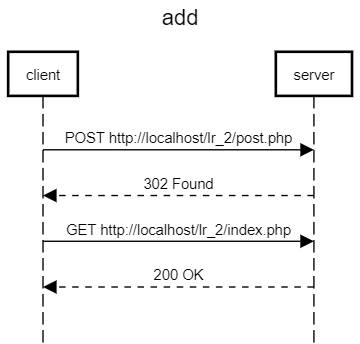
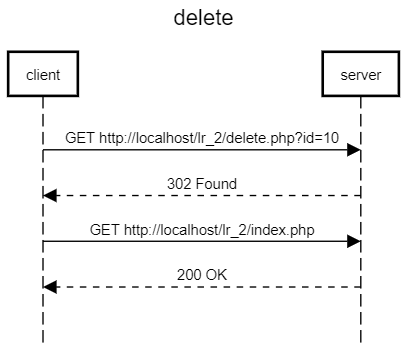
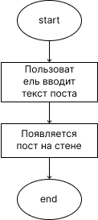
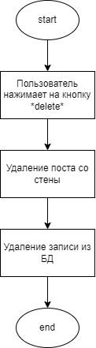

# Lab2-MedvedevAlexander
Лабораторная работа 2
## Основное задание
Разработать и реализовать клиент-серверную информационную систему, реализующую мехнизм CRUD. Система представляет собой веб-страницу с лентой заметок и форму добавления новой заметки. Система должна обладать следующим функционалом:

## Выполненные требования
-	Возможность добавления постов в общую ленту
-	Реагирования на посты (лайки и комментарии)
-	Публикация записей с прикреплением картинки

## Ход работы
-	Пользовательский интерфейс
-	Пользовательские сценарии
-	Описание структуры бызы данных
-	API сервера и хореография
-	Значимые фрагменты кода

## Пользовательский интерфейс
[Пользовательский интерфейс](https://www.figma.com/file/dYwv4dpGzfRuPbM2E0nhs7/%D0%A7%D0%B0%D1%82?node-id=0%3A1&t=Ku14XfvV7lfNvoVe-1)

## Пользовательский сценарий
1.	Пользователь вводит сообщение и нажимает enter, на экране появляется сообщение.
2.	Пользователь видит сообщение которое ему понравилось и нажимает кнопку Like. Счетчик лайков на данном посте увеличивается на 1.

## Описание структуры базы данных
Для администрирования сервера MySQL и просмотра содержимого базы данных используется браузерное приложение phpMyAdmin. Используется 5 столбцов:
1.	"message_id" типа int с автоматическим приращением для выдачи уникальных id каждому сообщению,
2.	"message_title" типа text для хранения заголовка комментария,
3.	"message_text" типа text для хранения сообщения комментария,
4.	"date" типа datetime для хранения даты и времени отправки сообщения на сайт,
5.	"likes" типа int для хранения числа лайков на этом сообщении.

## API сервера и хореография

 



*Add post*



*Delete post*




## Значимые фрагменты кода
1.	Функция отправки сообщения

```
  function setComments($conn) {
    if (isset($_POST['commentSubmit'])) {
        $uid = $_POST['uid'];
        $date = $_POST['date'];
        $message = $_POST['message'];
        $likes = $_POST['likes'];
        $dislikes = $_POST['dislikes'];
        $file = $_FILES['img'];
        $name = gen_str(5).".png";
        (@copy($file["tmp_name"], __DIR__.'/img/'.$name));
        $sql = "INSERT INTO comments (uid, date, message, likes, dislikes, image_id) VALUES ('$uid', '$date', '$message', '$likes', '$dislikes', '$name')";
        $result = $conn->query($sql);
        header('Location: index.php' );
    }
}

```
2 Функция добавления лайка

```
function likeSubmit($conn,$row) {
    if(isset($_POST[$row['cid']])) {
        $cid = $row['cid'];
        $likes = $row['likes']+1;
        $query = "UPDATE comments SET likes = '$likes' WHERE cid = '$cid'";
        $result = mysqli_query($conn, $query);
    }
}

```
